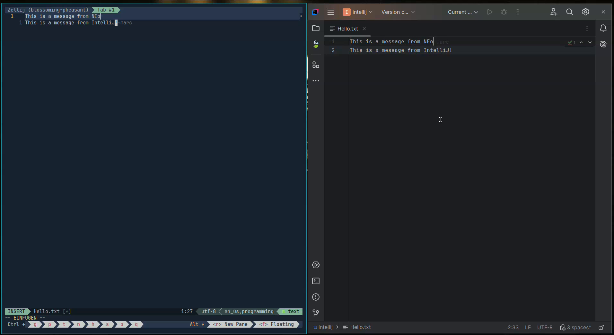

# Ethersync for Jetbrains Platform

This project provides a plugin that supports the Ethersync synchronization for
Jetbrains IDEs. For example, IntelliJ will get a Google Docs like experience
while the with whom you are working use their favorite editor, e.g. Neovim or
VSCode. Here is a short demo:

Currently, the project is in development but the pre-release version of the
plugin can be installed by downloading the latest ZIP from [here][nightly
download] and this ZIP can be installed into the Jetbrains product from disk
(see [install from disk] instructions for IntelliJ). Please note, that this
version currently only supports Ethersync 0.8.

# Development

The development instructions can be found [here](DEVELOPMENT.md).

[nightly download]: https://github.com/ethersync/ethersync-jetbrains/releases/tag/nightly
[install from disk]: https://www.jetbrains.com/help/idea/managing-plugins.html#install_plugin_from_disk
